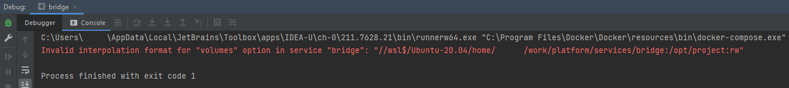
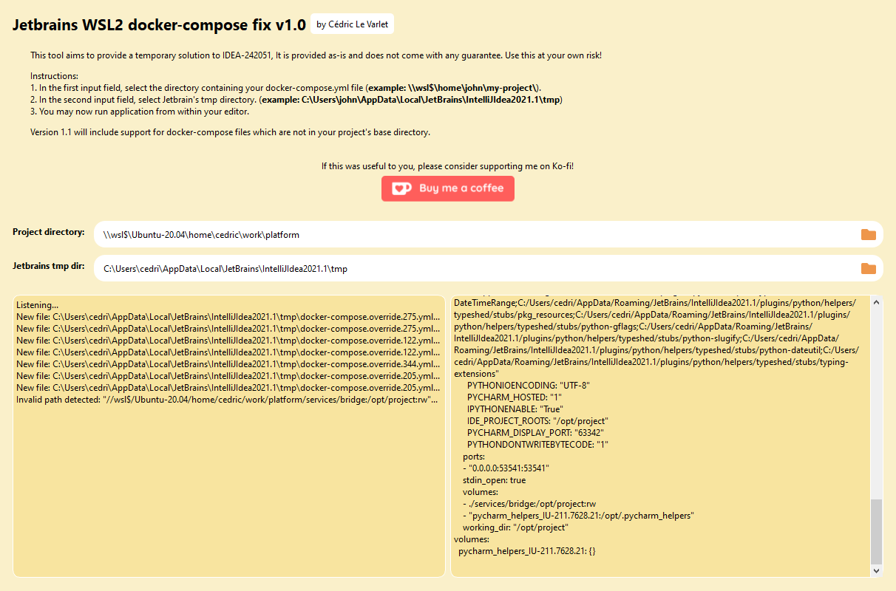

# Jetbrains WSL2 invalid interpolation fix

This tool aims to fix the `Invalid interpolation format` error which occurs on Jetbrain's IDEs when attempting to run a docker-compose 
application in WSL2.



## How does it work?

The tool listens to any file changes in the specified target directory (Jetbrain's tmp directory). If a docker-compose file is created, it will attempt to replace the invalid paths before Jetbrains has a chance to run the docker-compose command.



## Getting started

### Install the application 
#### Either download the executable

Every release has an exe file bundled with it. You can download it [here](https://github.com/cedriclevarlet/jetbrains.invalid-interpolation/releases/latest/download/jbwsl2.exe) to the directory of your choice.

#### or use pip (If you have python installed)

First we need to install the package
```shell
pip install git+ssh://git@github.com/cedriclevarlet/jbwsl2#1.0.1
```

### How do I run it?

Double click on the executable or, in your command prompt, type
```shell
jbwsl2.exe
```

Once the application is running and configured, you can go back to your editor and attempt to run your application with docker-compose.
Due to race condition issues, it could take a few tries before the application runs correctly.

## Optional arguments

- **-p**: root project directory containing the docker-compose.yml file
- **-t**: JetBrains tmp directory
- **-c**: JetBrains's $Classpath$ macro. This argument can be used instead of -t to automatically determine the correct temp path

example:
```shell
jbwsl2.exe -p \\wsl$\Ubuntu-20.04\home\john\example -t C:\Users\john\AppData\Local\JetBrains\IntelliJIdea2021.1\tmp
```


